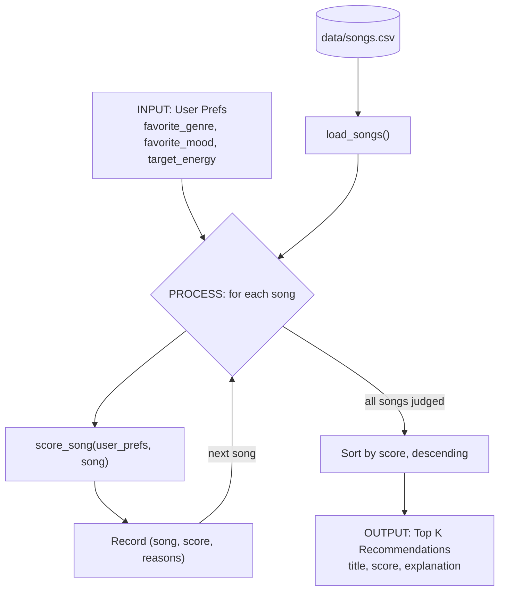

# 🎵 Music Recommender Simulation

## Project Summary

In this project you will build and explain a small music recommender system.

Your goal is to:

- Represent songs and a user "taste profile" as data
- Design a scoring rule that turns that data into recommendations
- Evaluate what your system gets right and wrong
- Reflect on how this mirrors real world AI recommenders

Replace this paragraph with your own summary of what your version does.

---

## How The System Works

Real-world recommenders such as Spotify's combine two broad approaches: collaborative filtering, which learns from what millions of other listeners play, skip and save, and content-based filtering, which compares the measurable characteristics of songs (genre, tempo, energy, mood) to what a listener already likes. My version is purely content-based. It has no listening history and no other users, so it can only compare a song's attributes to a single stated taste profile. It prioritizes **closeness of match** over popularity or novelty. Each song gets a score for how well it fits the user, and the highest-scoring songs are recommended. Genre carries the most weight, mood counts half as much, and energy is rewarded for being *near* the user's target, not for being high.

### Features used

**`Song`** (each row of `data/songs.csv`):

- `genre`, `mood`: categorical, used in scoring
- `energy` (0-1): numeric, used in scoring
- `tempo_bpm`, `valence`, `danceability`, `acousticness`: stored for each song and available for later experiments
- `id`, `title`, `artist`: identifiers, used for display only, not scoring

**`UserProfile`**:

- `favorite_genre`: the genre the user wants
- `favorite_mood`: the mood the user wants
- `target_energy` (0-1): the energy level the user wants
- `likes_acoustic`: whether the user prefers acoustic songs, a possible extra signal using `acousticness`

### Data flow



### Algorithm Recipe

Each song is scored on its own (the **scoring rule**), then all songs are sorted and the top `k` are returned (the **ranking rule**).

| Signal | Points | Rule |
|---|---|---|
| Genre match | +2.0 | song genre equals `favorite_genre`, otherwise 0 |
| Mood match | +1.0 | song mood equals `favorite_mood`, otherwise 0 |
| Energy similarity | 0.0 to +1.0 | `1.0 - abs(song.energy - target_energy)` |

```
score = 2.0 * genre_match + 1.0 * mood_match + (1.0 - |song.energy - target_energy|)
```

- **Maximum score:** 4.0 (genre, mood and energy all match perfectly).
- **Why genre is worth double mood:** genre is a stable, coarse part of someone's taste, while mood shifts from hour to hour.
- **Why energy uses closeness:** rewarding raw energy would always favor loud songs. Closeness lets a user who wants calm music get calm songs.
- **Ranking rule:** sort by score, highest first, and break ties by smaller energy gap, then title, so results are deterministic. Return the top `k` with a plain-language reason for each (for example, "genre match (+2.0)").

### Expected biases

- **Genre can dominate.** A genre match is worth up to twice a mood match, so a song in the right genre but the wrong mood and energy can outrank a song that fits the user's mood and energy perfectly. Great mood matches in other genres may be buried.
- **Genre labels are exact-match.** "pop" and "indie pop", or "hip-hop", "rap" and "trap", count as completely different genres, so closely related songs get no credit.
- **Tiny catalog.** Most genres have only one song, so a genre match often decides the top result on its own, and users whose genre is not in the catalog get recommendations driven only by mood and energy.
- **Mood is all-or-nothing.** "chill" and "relaxed" are treated as unrelated, even though a listener would likely enjoy both.
- **Unused features.** Tempo, valence, danceability and acousticness are ignored, so two songs that feel very different can score the same.
- **Single-profile assumption.** One fixed taste profile cannot capture a listener whose preferences change by context, and there is no novelty, so the system tends to repeat the same kind of song.

---

## Getting Started

### Setup

1. Create a virtual environment (optional but recommended):

   ```bash
   python -m venv .venv
   source .venv/bin/activate      # Mac or Linux
   .venv\Scripts\activate         # Windows

2. Install dependencies

```bash
pip install -r requirements.txt
```

3. Run the app:

```bash
python -m src.main
```

### Running Tests

Run the starter tests with:

```bash
pytest
```

You can add more tests in `tests/test_recommender.py`.

---

## Sample Recommendation Output

Output of `python src/main.py` for the three built-in profiles (`my_taste`, `high_energy`, `low_energy`). Each song shows its final score out of 4.00 and the reasons that produced it.

```
================================================================
 Top 5 recommendations for: my_taste
================================================================

1. Love Yourz  by J. Cole
   Score: 3.98 / 4.00
   Why:
     - genre match: rap (+2.0)
     - mood match: reflective (+1.0)
     - energy 0.48 vs target 0.50 (+0.98)

2. Heart on Ice  by Rod Wave
   Score: 3.88 / 4.00
   Why:
     - genre match: hip-hop (+2.0)
     - mood match: melancholic (+1.0)
     - energy 0.38 vs target 0.50 (+0.88)

3. First Day Out  by Tee Grizzley
   Score: 2.56 / 4.00
   Why:
     - genre match: trap (+2.0)
     - energy 0.94 vs target 0.50 (+0.56)

4. Let Me Love You  by Mario
   Score: 0.96 / 4.00
   Why:
     - energy 0.54 vs target 0.50 (+0.96)

5. Midnight Coding  by LoRoom
   Score: 0.92 / 4.00
   Why:
     - energy 0.42 vs target 0.50 (+0.92)

----------------------------------------------------------------

================================================================
 Top 5 recommendations for: high_energy
================================================================

1. Levels  by Avicii
   Score: 4.00 / 4.00
   Why:
     - genre match: EDM (+2.0)
     - mood match: uplifting (+1.0)
     - energy 0.95 vs target 0.95 (+1.00)

2. First Day Out  by Tee Grizzley
   Score: 3.99 / 4.00
   Why:
     - genre match: trap (+2.0)
     - mood match: aggressive (+1.0)
     - energy 0.94 vs target 0.95 (+0.99)

3. Enter Sandman  by Metallica
   Score: 2.98 / 4.00
   Why:
     - genre match: metal (+2.0)
     - energy 0.97 vs target 0.95 (+0.98)

4. Gym Hero  by Max Pulse
   Score: 0.98 / 4.00
   Why:
     - energy 0.93 vs target 0.95 (+0.98)

5. Storm Runner  by Voltline
   Score: 0.96 / 4.00
   Why:
     - energy 0.91 vs target 0.95 (+0.96)

----------------------------------------------------------------

================================================================
 Top 5 recommendations for: low_energy
================================================================

1. Clair de Lune  by Claude Debussy
   Score: 3.94 / 4.00
   Why:
     - genre match: classical (+2.0)
     - mood match: dreamy (+1.0)
     - energy 0.14 vs target 0.20 (+0.94)

2. Spacewalk Thoughts  by Orbit Bloom
   Score: 3.92 / 4.00
   Why:
     - genre match: ambient (+2.0)
     - mood match: chill (+1.0)
     - energy 0.28 vs target 0.20 (+0.92)

3. Library Rain  by Paper Lanterns
   Score: 3.85 / 4.00
   Why:
     - genre match: lofi (+2.0)
     - mood match: chill (+1.0)
     - energy 0.35 vs target 0.20 (+0.85)

4. Midnight Coding  by LoRoom
   Score: 3.78 / 4.00
   Why:
     - genre match: lofi (+2.0)
     - mood match: chill (+1.0)
     - energy 0.42 vs target 0.20 (+0.78)

5. Focus Flow  by LoRoom
   Score: 2.80 / 4.00
   Why:
     - genre match: lofi (+2.0)
     - energy 0.40 vs target 0.20 (+0.80)

----------------------------------------------------------------
```

---

## Experiments You Tried

Use this section to document the experiments you ran. For example:

- What happened when you changed the weight on genre from 2.0 to 0.5
- What happened when you added tempo or valence to the score
- How did your system behave for different types of users

---

## Limitations and Risks

Summarize some limitations of your recommender.

Examples:

- It only works on a tiny catalog
- It does not understand lyrics or language
- It might over favor one genre or mood

You will go deeper on this in your model card.

---

## Reflection

Read and complete `model_card.md`:

[**Model Card**](model_card.md)

Write 1 to 2 paragraphs here about what you learned:

- about how recommenders turn data into predictions
- about where bias or unfairness could show up in systems like this


